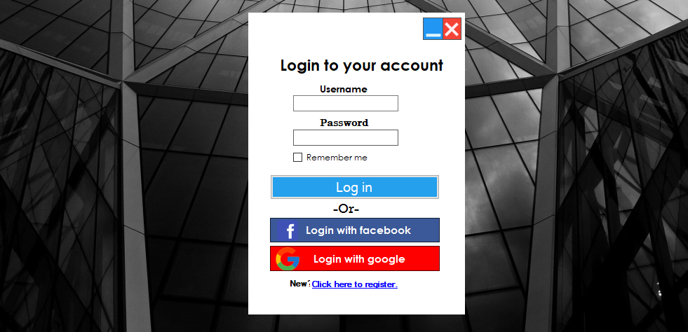

# Assignment Management System

Assignment management system is the desktop application using .Net framework and c# language. In this application, users can not only save, edit or delete the records but also view and search the records. To access these functionalities, users have to login to their account with username and password(for now, you can use any username and password must be at least 6 characters long). 

---

---

## Applications required

- You must install Microsoft Visual Studio as IDE.
- You are required to install Microsoft SQL Server Express and Microsoft SQL Server Management Studio.

---

## Steps to follow

1. Download and extract zip file.
2. Using SSMS, create a database 'AssignmentDB' and restore database file 'AssignmentDB.bak'.
3. Run AssignmentDB_Project.sln with Visual Studio.
4. Change data source of the connection string in dbconnection.cs file.
Note: You can get your datasource in the server explorer window in Visual Studio.
5. Start the application.

---

## Features

1. Login form- The form from where users can login to their account by providing correct username and password.
2. Dashboard- The module from where user can enter inside the modules. There are options like menu, edit, help, support and logout.
3. Faculty form- The form where we can add, edit and delete faculty. We can add new faculty by providing id, name and description of faculty. We can also view records of faculty in faculty list. Additionally, we can also search record from the faculty list.
4. Student form- The form where we can add, edit and delete student. We can add new student by providing id, name, section, email, contact and remark of the student. We can also view records of student in student list. Moreover, we can also search record from the student list.
5. Teacher form- The form where we can add, edit and delete teacher. We can add new teacher by providing id, name, email and contact of teacher. We can also view records of teacher in teacher list. Furthermore, we can also search record from the teacher list.
6. Subject form- The form where we can add, edit and delete subject. We can add new subject by providing id, name and remark of subject. We can also view records of subject in subject list. Additionally, we can also search record from the subject list.
7. Assignment form- The form where we can add, edit and delete assignment. We can add new assignment by providing assignment id, student name, teacher name, subject name, status name, date of submission and comment. We can also view records of assignment in assignment list. Also, we can also search record from the assignment list. 
